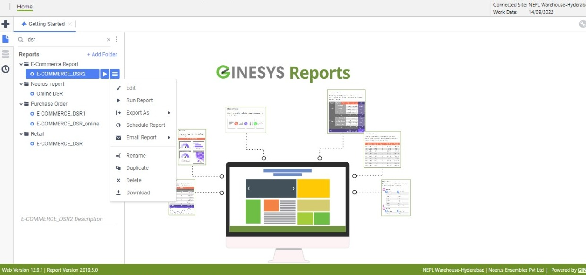

# Ginesys | Fynd Integration

## Scope of Integration

### Prerequisite

- The integration done with Ginesys is divided into two parts as below:
  - **Inventory**: Ginesys is using Fynd API endpoints to update inventory.
  - **Orders**: Fynd is using Ginesys API for Sales and Returns posting purposes only, and the rest of the flow is managed on Fynd OMS itself.

- Mandatory details required are as below which should be provided by the Integration Partner of Ginesys over email. It is suggested to route this email via Seller.

| Parameters     | Level         | Mandatory | How to get it | To be provided by | Description                                                                                       |
|----------------|---------------|-----------|----------------|-------------------|---------------------------------------------------------------------------------------------------|
| GDS Entity ID  | Company level | Yes       | Email          | Ginesys           | Unique identifier for every company                                                               |
| IP Address      | Company level | Yes       | Email          | Ginesys           | IP address of the POS server of the company                                                      |
| Auth key       | Company level | Yes       | Email          | Ginesys           | Auth key to grant access to the server                                                             |
| ICODE          | Company level | Yes       | Email          | Brand             | Code defined to specify update quantity against which identifier on Fynd and for sales posting to Ginesys |

Also, share the below channel codes with Ginesys over an email for the LEDGER/MOP setup for the seller.

| Channel Code              | Ledger         |
|---------------------------|----------------|
| FYND                      | FYND           |
| ECOMM (Website)          | ECOMM          |
| FY_AMAZON                 | AMZ            |
| FY_MYNTRA                 | MYNTRA         |
| UNIKET_B2B               | UNIKETB2B      |
| FY_TATACLIQ              | TATACLIQ       |
| FY_FLIPKART_ASSURED      | FPKARTASD      |
| FY_AJIO                  | AJIO_VMS       |
| FY_MAGICPIN              | MGPN           |
| FY_SHOPIFY               | SHOPIFY_IN     |
| FY_NYKAA_FASHION         | NYKAA_FASHION  |
| FY_FLIPKART              | FLIPKART       |




## Functional Flow

### Guide - Setup Ginesys on Fynd

To onboard/integrate any new/existing store to Ginesys POS, please follow the below steps:

1. Go to [Fynd Platform](https://platform.fynd.com/) and select the desired company.
2. Select Ginesys integration under the Fynd platform integration section:
   - Fynd Platform → Settings → Integrate
3. From the integration list, select Ginesys.
4. Enter the details provided by Ginesys on the given form page.
5. Once you have filled in the mandatory details, proceed to save Ginesys integration for the seller.
6. The next step would be to share the username (integration ID) and company password (company token) with Ginesys.

### Enable New Store to Ginesys Integration

- Check if the store is verified in the Profile section of the Fynd Platform.
- Get the store mapping from the seller as per Ginesys Location Code.
- Enable Inventory and Order checkboxes of the store to activate integrations.

> **Note**: Location ID and Channel Code should be left blank as it is not required.

### Guide - Order Processing

1. Order placed by the customer on any marketplace will reflect on the Fynd OMS system.
2. The store/warehouse person in charge will have to go to Fynd OMS via [seller.fynd.com](https://seller.fynd.com).
3. Click on the "Go to Order Manager" button on the top right of the page.
4. You will see the new order in the NEW tab section of the page.
5. Check for the product's physical availability and click on the Confirm button to proceed.
6. Once the order is confirmed, it is auto-invoiced at Fynd’s end.
7. This invoice detail is posted to the Ginesys system for Sales Posting.
8. Go to the "TO BE PACKED" tab.
9. Check the relevant order and then click on the label & invoice download buttons.
10. Now pack the shipment and keep it ready for dispatch by clicking on the "All Packed" button.

### Guide - To Download Sales Posted on Ginesys

1. Go to `Reports > E-Commerce Report > E-COMMERCE_DSR2`.
2. From the menu list, select `Export As`.
3. Now select the format as `Excel`.
4. It will show the progress bar for Report Execution.
5. Sample of the exported Excel file for Sales Invoice Posted.

## Technical Flow

### Inventory Integration

#### Understanding

- Ginesys uses Fynd Inventory API v2.
- Ginesys generates an API token by using the username (integration ID) and password (company token) provided by Fynd.
- Ginesys pushes the inventory against the respective seller identifier.
- FULL SYNC job runs once a day.
- DELTA inventory is sent whenever there is any activity on any article.
- Ginesys uses a checker API to check the status of the inventory pushed.

#### API Endpoints

[Postman collection](https://www.getpostman.com/collections/b7d85d1651c37566d5d9)

1. **Authentication**

   - **Request**
     - **Method**: GET
     - **Endpoint**: `https://{{host}}/hogwarts/aggregators/api/v1/{{aggregator}}/shipment/authToken`
     - **Query Params**:
       - `username=xxxx`
       - `password=zzzz`

     Example:
     ```
     https://{{host}}/hogwarts/aggregators/api/v1/{{aggregator}}/authToken?username=xxxx&password=zzzz
     ```

   - **Response**
   ```json
   {
     "status": "SUCCESS",
     "accessToken": "61780580-3ff6-4dbb-b6d8-7955b5904a45"
   }
